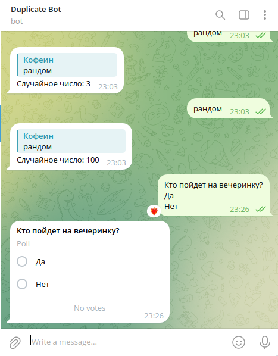

### Создание формы опроса

**Описание:**

Этот бот Telegram создает опросы из текстовых сообщений пользователей. 

**Ключевые особенности:**

* Проверяет, что в сообщении пользователя от 3 до 11 строк (включая вопрос).
* Первая строка сообщения пользователя - вопрос.
* Вторые - одиннадцатые строки - варианты ответов.
* Использует метод `send_poll` для создания опроса.

**Инструкции:**

1. Замените `"YOUR_TOKEN"` на ваш токен API бота Telegram.
2. Запустите файл Python.
3. Отправьте сообщение боту, следуя формату:
    * **Вопрос:**
    * **Вариант ответа 1:**
    * **Вариант ответа 2:**
    * ...

**Пример:**

**Пользователь:** Какое твое любимое животное?
           Собака
           Кошка
           Птица

**Бот:** Создает опрос с вопросом "Какое твое любимое животное?" и вариантами ответов "Собака", "Кошка", "Птица".

**Комментарии:**

* Код написан с использованием PEP8.
* Код содержит комментарии, объясняющие логику.

**Скриншот:**

