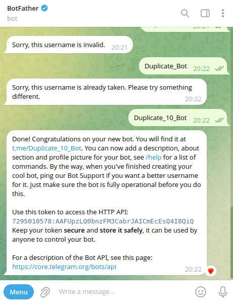

# Создание бота
Зашел на  `@BotFather`

Нажал на кнопку `start`

Вписал `/newbot` для создания нового бота.

Дал название боту `Duplicate Bot`

Вписал имя пользователя для бота `Duplicate Bot`

Получил API:

И получил ссылку на бота https://t.me/Duplicate_10_Bot

После запуска кода бот заработал и продублировал 10 раз мой текст.

