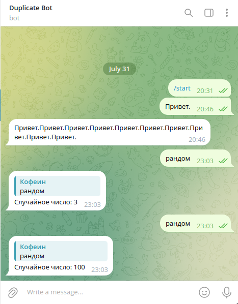

## Рандомное число в слове

**Описание:**

Этот бот Telegram обрабатывает текстовые сообщения. Если в сообщении встречается слово "рандом" (в любом месте), он отправляет случайное число от 0 до 100. В любом другом случае он дублирует текст пользователя.

**Ключевые особенности:**

* Два разных хэндлера для обработки сообщений.
* Использование библиотеки `telebot`.
* Генерирование случайного числа с помощью `random.randint`.

**Инструкции:**

1. Замените `"YOUR_TOKEN"` на ваш токен API бота Telegram.
2. Запустите файл Python.
3. Отправьте сообщение боту.

**Пример:**

**Пользователь:** Привет, бот!
**Бот:** Привет, бот!

**Пользователь:** Давай рандомное число!
**Бот:** Случайное число: 73

**Комментарии:**

* Код написан с использованием PEP8.
* Код содержит комментарии, объясняющие логику.

**Скриншот:**

