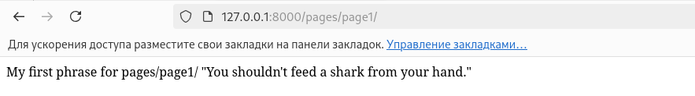
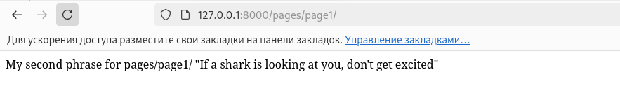
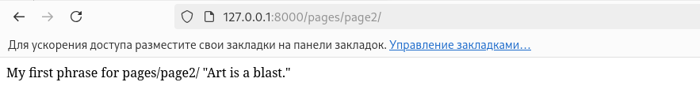
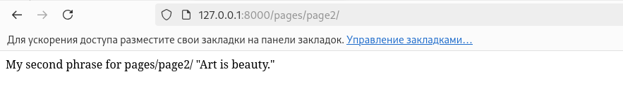

# Routing

This project provides simple phrase output using the Django framework.

## Project Overview

The following steps were performed during development:

1. **Application Addition**.  
   In the `Routing/mod4/mod4/settings.py` file, the custom application `routing` was added to the list of installed applications:

   ```python
   INSTALLED_APPS = [
       'django.contrib.admin',
       'django.contrib.auth',
       'django.contrib.contenttypes',
       'django.contrib.sessions',
       'django.contrib.messages',
       'django.contrib.staticfiles',
       
       'routing',
   ]
   ```

2. **Creating phrase routing**  
A code was written in the path `Routing/mod4/routing/views.py`. To do this, the `random.choice` method was imported where this method selects randomly from the `phrase` list and outputs that phrase.

   ```python
# from django.shortcuts import render
from django.http import HttpResponse
import random

# Create your views here.


def page1(request):

    phrase = [
            '''My first phrase for pages/page1/
            "You shouldn't feed a shark from your hand."''',
            '''My second phrase for pages/page1/
            "If a shark is looking at you, don\'t get excited"''',
            ]

    phrase_random = random.choice(phrase)
    return HttpResponse(phrase_random)


def page2(request):

    phrase = [
            '''My first phrase for pages/page2/ "Art is a blast."''',
            '''My second phrase for pages/page2/ "Art is beauty."''',
            ]

    phrase_random = random.choice(phrase)
    return HttpResponse(phrase_random)
   ```

3. **Configuring Routes**  
   In the file `Routing/mod4/mod4/urls.py`, the path to the application was specified as follows:

   ```python
...
from routing.views import page1, page2

urlpatterns = [
    ...
    path('pages/page1/', page1),
    path('pages/page2/', page2),
    ]
   ```

## Output various phrases
### page1

Going to `127.0.0:8000/pages/page1/`.
The output will be:


### page2
Going to `127.0.0.1:80000/pages/pages/page2/`.
There will be output:

