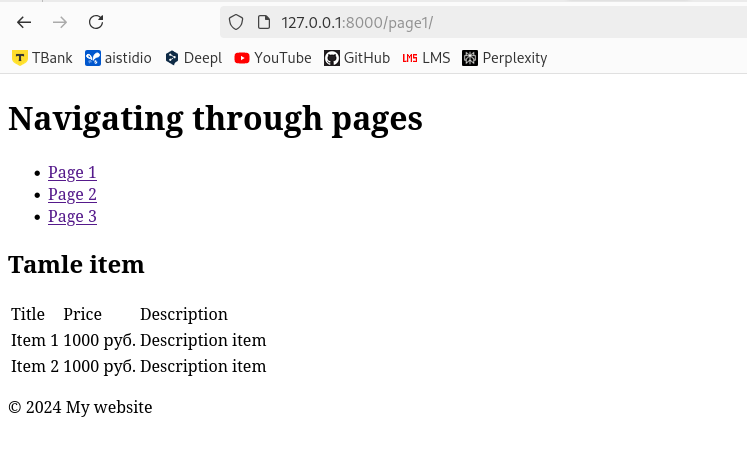
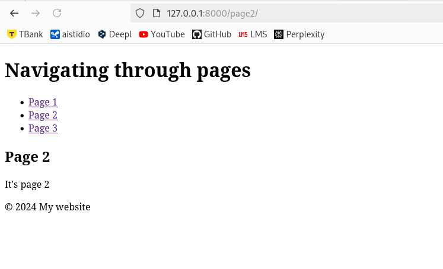

## File Descriptions

### `settings.py`

In the `settings.py` file, we added `temlates_base` to the list of installed applications:

```python
INSTALLED_APPS = [
    'django.contrib.admin',
    'django.contrib.auth',
    'django.contrib.contenttypes',
    'django.contrib.sessions',
    'django.contrib.messages',
    'django.contrib.staticfiles',
    'temlates_base',
]
```

### `views.py`

In the `views.py` file, we defined functions for rendering the pages:

```python
from django.shortcuts import render

def home(request):
    return render(request, 'base/base.html')

def page1(request):
    return render(request, 'page/page_1.html')

def page2(request):
    return render(request, 'page/page_2.html')

def page3(request):
    return render(request, 'page/page_3.html')
```

### `urls.py`

The `urls.py` file contains routes for each page:

```python
from django.urls import path
from temlates_base.views import page1, page2, page3

urlpatterns = [
    path('admin/', admin.site.urls),
    path('page1/', page1, name='page_1'),
    path('page2/', page2, name='page_2'),
    path('page3/', page3, name='page_3'),
]
```

### `base.html`

The base template `base.html` defines the common structure for the pages:

```html
<!DOCTYPE html>
<html lang="en">
<head>
    <meta charset="UTF-8">
    <meta name="viewport" content="width=device-width, initial-scale=1.0">
    <title>My website</title>
</head>
<body>
    <header>
        <h1>Navigating through pages</h1>
        <nav>
            <ul>
                <li><a href="">Page 1</a></li>
                <li><a href="">Page 2</a></li>
                <li><a href="">Page 3</a></li>
            </ul>
        </nav>
    </header>

    <main>
        
    </main>

    <footer>
        <p>© 2024 My website</p>
    </footer>
</body>
</html>
```

### `page_1.html`

On the first page, we created a table with three columns: title, price, and description:

```html


Page 1


<h2>Product Table</h2>
<table>
    <tr>
        <th>Title</th>
        <th>Price</th>
        <th>Description</th>
    </tr>
    <tr>
        <td>Item 1</td>
        <td>1000 rub.</td>
        <td>Description of item 1</td>
    </tr>
    <tr>
        <td>Item 2</td>
        <td>1500 rub.</td>
        <td>Description of item 2</td>
    </tr>
</table>

```

### `page_2.html` and `page_3.html`

Pages 2 and 3 contain simple text blocks:

```html


Page 2


<h2>Page 2</h2>
<p>This is page 2</p>

```

```html


Page 3


<h2>Page 3</h2>
<p>This is page 3</p>

```

## Running the Project

To run the project, follow these steps:

1. Ensure that you have Django installed.
2. Navigate to the project directory and run the command:
   ```bash
   python manage.py runserver
   ```
3. Open your browser and go to `http://127.0.0.1:8000/page1/` to view the first page.

## Conclusion

Eventually navigating to the page we should see this:


